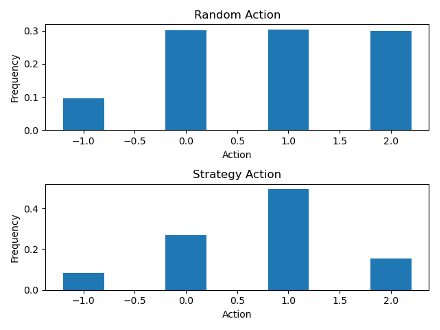
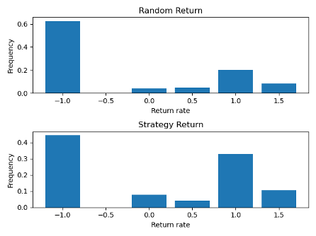

# black_jack
BlackJack Game Simulation &amp; Strategy

required python library:
 - Numpy
 - Numba
 - Pandas (Reporting Purpose only)
 -Maplotlib (Reporting purpose only)

Black Jack Implementation

In this simulation, I have followed the rules laid out by the editors at 
Pagat.com (From Introduction to Payouts, https://www.pagat.com/banking/blackjack.html)
I have plotted the flow chart to describe the high-level logic of one round of Black Jack in Figure 1. In this graph, the color filled (coral, grey and blue) boxes are final outcome of a game. Once we know the outcome, a payout utility is initiated to calculate the payout amount to the player.

There are some assumptions required in this simulation:

1.	If the insurance option is available, all players will always activate the insurance bet by adding 50% of the initial bets. If dealer hits Black-Jack, all bets will be returned to player as per payout rules; if the dealer does not hit Black Jack, the game will continue with each player having 1.5 times of the initial bets.
2.	For convenience of simulation, we will always be the first player on the table. It means that at the stage “Player Deploy Strategy”, we will be the first player to make the move.
3.	For simplicity of the simulation, we assume that the viable actions for the players are only stand (draw no more cards), hit once (draw 1 card) and hit twice (draw 2 cards). We are ignoring the “Double Down” and “Split” action.
4.	We assume that in this game, we know the number of decks used in each player as well as the holding of the other players. At the end of each game, all cards (including unused) will be discard and new decks will be used in the next game.

Additional assumptions are introduced to assist the development of betting strategy. Please refer to the Betting Strategy section for details.

Betting Strategy

After dealer checked its cards for Back Jack, it is players turn to act. As mentioned before, in this study, we are only interested in decision making among actions of drawing no card, drawing 1 card and drawing 2 cards. Two strategies were proposed in order to compare the profitability. The first strategy is simply random selection among the three actions; the second strategy uses simulation on the possible outcome and select the action with highest probability to win.

Random Selection: The mechanism is very simply. When it is our turn, we pick 3 actions with equal probability to decide our action (Line 192 – 201) by ignoring the holdings of other players and the dealer.

Simulation: Because we know how many decks are used in each game and the holding of all players (and one card from dealer). We can simulate all possible situations under three actions and check the possibility of winning. The simulation will provide us with the action with the highest probability of not losing (push/draw or win). In order to simplify our simulation, we will ignore the other players and only simulate cards between us and the dealer. Indeed, other players’ cards may impact the possibility of drawing certain cards; however, it won’t directly impact our profit and loss since the result is determined based on cards between dealer and individual players.

Function simulate_prob (line 395) is designed to simulate and calculate our winning probability, it takes information on our current 2 cards, the one card revealed by the dealer and all cards not yet drawn and run 10,000 simulation under each possible action (draw no card, draw 1 card and draw 2 cards). Under each simulation, we will first pick up a card as the hidden card of the dealer. Then we will draw the desired number of cards (0,1, or 2) for us. Subsequently, the dealer will draw cards if his/her total score is less than 17 or his/her score is lower than us. We can simply count the number of times that it is a push/draw or we win and calculate the possibility of not losing. This function will return such possibility of under all 3 scenarios.

Outcome Analysis
In this analysis, we simulated 1000 plays involving 3 players and 2 decks of poker using each strategy and compared the rate of return. Because insurance requires additional bets, it is hard to control the betting amount. So rate of return seems to be a better performance indicator for comparison purpose.

Table 1 shows the outcome from the 1000 simulation under each strategy. As we can see from the average return, the simulation strategy on average has a positive return rate of 6.4%, meaning that we can actually make profit by using this strategy. On the other hand, the random actin strategy on average lost 27.3%. From the count number, it shows that out of 1000 games, random strategy lost 625 of them. It is expected since after distribution of first 2 cards, it is the players to make actions before the dealer. The players would go bust first, losing all their bets to the dealer. The simulation strategy makes decision based on current cards revealed in the game to optimize the probability of winning, improving the return rate of the game.

Outcome:

It is also interesting to check what’s the optimal action recommended by the algorithm. Tale 2 blow plots the frequency of each action under 2 strategies as well as the return rate. Notice that it is possible for the game to terminate before any simulation is carried out (either dealer or us hit Black Jack). Action equals to -1 represents those outcomes. As expected, the random strategy shows equal profamily on selecting any actions. In the simulated results, it is most common to pick one card. In fact, in 1000 games, simulation strategy recommended drawing 1 card 494 times. It seems that if we cannot bring this simulation with us to the game, we may be able to just draw one card in each game in order to improve our chances of winning or at least not lose).

